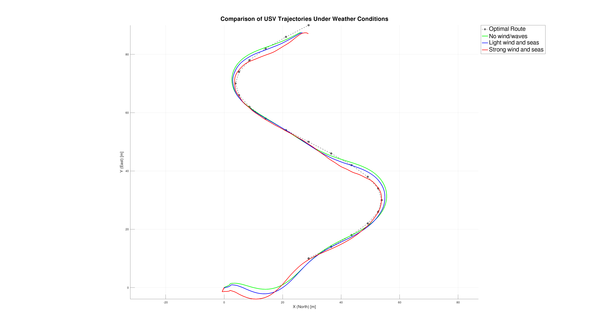
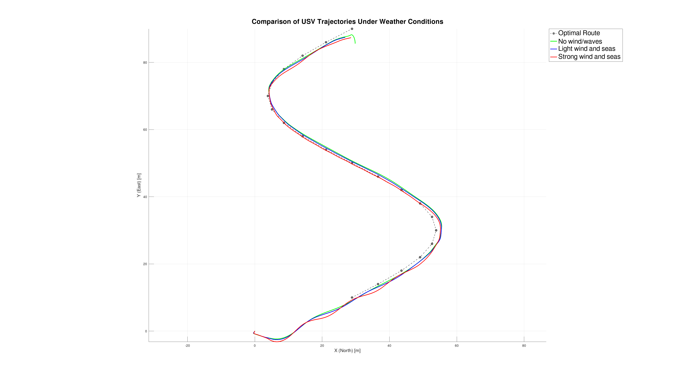

# VRX USV Control — ILOS + LQR & NMPC

> Autonomous surface vehicle (USV) control framework built on top of the [VRX](https://github.com/osrf/vrx) simulation environment.  
> Implements and compares two independent control strategies: **ILOS + LQR** and **NMPC**.

---

## Overview

This repository provides a complete ROS 2 control stack for simulating and evaluating two autonomous guidance and control approaches for an Unmanned Surface Vehicle (USV) in the VRX Gazebo environment:

- **ILOS + LQR** — Integral Line-of-Sight guidance combined with a Linear Quadratic Regulator for path following.
- **NMPC** — Nonlinear Model Predictive Control for trajectory tracking.

Both controllers can be tested independently on configurable trajectories (Hexagonal path or S-curve path) under varying environmental conditions (wind, waves).

---

## Prerequisites

### 1. Install Docker or ROS 2 Jazzy

You need either:
- **Docker** (recommended for a clean, reproducible environment), or
- **ROS 2 Jazzy** installed natively on your machine.

> Follow the official VRX installation guide:  
> [https://github.com/osrf/vrx/wiki/installation_method_tutorial](https://github.com/osrf/vrx/wiki/installation_method_tutorial)

---

## Installation

### Step 1 — Create the VRX workspace and clone the official VRX repository

Follow the steps in the official VRX wiki to set up your workspace. After completing those steps, your workspace should look like:

```
vrx_ws/
└── src/
    └── vrx/   ← official VRX repository
```

### Step 2 — Clone this repository into `src/`

```bash
cd ~/vrx_ws/src
git clone https://github.com/danisanch018/vrx-usv-control.git
```

### Step 3 — Build the workspace

```bash
cd ~/vrx_ws
colcon build --merge-install
source install/setup.bash
```

---

## Configuration

### Spawn Position

The default VRX world spawns the USV at coordinates `(-600, 300)`. For the trajectories provided in this repository, it is recommended to change the spawn position to `(-532, 162)`.

Edit the file:
```
vrx/vrx_gz/launch/competition.launch.py
```
and update the spawn coordinates accordingly. You may freely change these values if you want to test your own trajectories.

---

### Trajectory Selection

You can switch between the two available paths by editing:

```
vrx-usv-control/usv_control/config/trajectory.yaml
```
Or you can simply add the points that you want.

---

### EKF State Estimation

To tune the Extended Kalman Filter (EKF) estimated states, edit:

```
vrx-usv-control/usv_control/config/ekf.yaml
```

---

### LQR and NMPC Parameters

To adjust the LQR controller gains and parameters, edit:

```
vrx-usv-control/usv_control/config/control_parameters.yaml
```
To adjust the NMPC parameters, edit:

```
vrx-usv-control/usv_control_py/usv_control_py/config/nmpc_config.yaml
```
---

### Wind and Wave Conditions

To modify the environmental simulation parameters (wind speed, wave gain, wave steepness), edit the custom world file:

```
vrx-usv-control/usv_control/worlds/sydney_regatta.sdf
```

---

## Launching the System

### Full system launch (controller + path publisher)

```bash
ros2 launch usv_control competition_full.launch.py use_lqr:=true
```

| Parameter | Value | Description |
|---|---|---|
| `use_lqr` | `true` | Use **ILOS + LQR** controller |
| `use_lqr` | `false` | Use **NMPC** controller |

> **Note on launch files:**
> - `competition.launch.py` — launches **only** the `path_publisher` node (publishes waypoints from `trajectory.yaml`).
> - `competition_full.launch.py` — launches the full stack: `path_publisher` + **ILOS + LQR** *or* **NMPC** controller.

---

### Visualize the trajectory in RViz

In a separate terminal, run:

```bash
ros2 launch vrx_gazebo rviz.launch.py
```

Then inside RViz:
1. Change the **Fixed Frame** to `odom`.
2. Add a **Path** display and subscribe to the `/path_publisher` topic.

---

## Experimental Results

The following results compare the performance of both controllers under three environmental configurations:

| Configuration | Wind Speed | Wave Gain | Wave Steepness |
|---|---|---|---|
| **Config 1** | No wind | No waves | No waves |
| **Config 2** | 6 m/s | 0.5 | 1.0 |
| **Config 3** | 12 m/s | 1.2 | 1.5 |

---

### ILOS + LQR and NMPC Results for curve path

| ILOS + LQR | NMPC |
| :---: | :---: |
| [](docs/assets/lqr.png) | [](docs/assets/nmpc.png) |

---

## Repository Structure

```
vrx-usv-control/
├── scripts/
│ └── lqr_gains.m # Offline LQR gain computation
│
├── usv_control/                     # C++ package (LQR controller & setup)
│   ├── config/
│   │   ├── control_parameters.yaml  # LQR gain tuning
│   │   ├── ekf.yaml                 # EKF state estimation parameters
│   │   └── trajectory.yaml          # Trajectory selection & waypoints
│   ├── src/
│   │   ├── generate_ref.cpp         # ILOS node
│   │   └── lqr_control.cpp          # LQR controller node
│   ├── worlds/
│   │   └── sydney_regatta.sdf       # Custom world (wind & wave conditions)
│   └── package.xml
│
└── usv_control_py/                  # Python package 
    ├── usv_control_py/
    │   ├── config/
    │   │   └── nmpc_config.yaml     # NMPC controller parameters
    │   ├── nmpc_control.py          # NMPC controller node
    │   └── path_publisher.py        # Waypoint publisher node
    ├── setup.py
    └── package.xml
```

---

## Acknowledgements

This repository was developed using the [VRX (Virtual RobotX)](https://github.com/osrf/vrx) simulation framework, maintained by the Open Source Robotics Foundation (OSRF). All VRX-related components are subject to their original license and terms.

If you use this work or the VRX simulation environment, please cite the official VRX paper:

```bibtex
@inproceedings{bingham19toward,
  title     = {Toward Maritime Robotic Simulation in Gazebo},
  author    = {Brian Bingham and Carlos Aguero and Michael McCarrin and Joseph Klamo and Joshua Malia and Kevin Allen and Tyler Lum and Marshall Rawson and Rumman Waqar},
  booktitle = {Proceedings of MTS/IEEE OCEANS Conference},
  address   = {Seattle, WA},
  month     = {October},
  year      = {2019}
}
```
---

## Contact

For questions, issues, or contributions, feel free to open an [issue](https://github.com/danisanch018/vrx-usv-control/issues).
